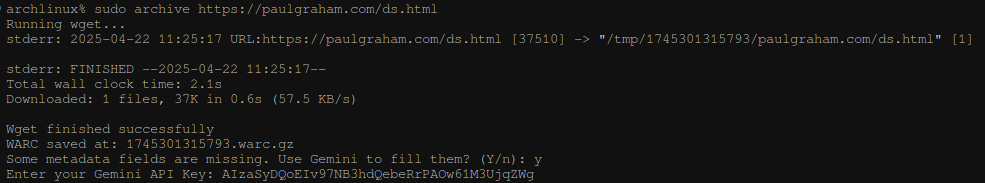

# 📦 archive

A powerful pipeline to **extract, convert, and preserve webpages** into structured archives with:

- Cleaned metadata
- Markdown conversion
- Media extraction
- Outbound links
- WARC (Web ARChive) file generation
- Optional AI assistance via **Gemini LLM** for missing metadata



---

## ✨ Features

- 🧠 Auto-extract readable content via [Mozilla Readability](https://github.com/mozilla/readability)
- 📝 Converts HTML content to Markdown using [Turndown](https://github.com/mixmark-io/turndown)
- 📦 Saves full WARC archive using `wget`
- 🔎 Extracts all media and outbound links
- 🤖 Optionally uses **Gemini AI** to fill missing metadata like author, date, description

---

## 📥 Installation

```bash
npm install -g archive
```

---

## 🚀 Usage

```ts
import { archivePipeline } from "archive";

const result = await archivePipeline("https://example.com/article");

console.log(result.metadata); // title, author, date, dek, lead_image_url
console.log(result.markdown); // Markdown version of the page
console.log(result.media); // List of image and video URLs
console.log(result.links); // List of all hyperlinks
console.log(result.warcPath); // Path to saved .warc.gz file
```

---

## 📚 Output Format

```ts
type ArchiveResult = {
  metadata: {
    title: string | null;
    author: string | null;
    date_published: string | null;
    dek: string | null;
    lead_image_url: string | null;
  };
  markdown: string;
  media: string[];
  links: string[];
  warcPath: string;
};
```

---

## 🧠 Gemini LLM Integration (Optional)

If fields like `author`, `date_published`, or `dek` are missing, the CLI will ask:

> "Would you like to use Gemini AI to infer missing metadata?"

If you agree, you’ll be prompted to **safely enter your API key**, and the model will use the page’s title and content to generate richer metadata.

> ✅ Your key is never saved without consent.

---

## 🔧 Dependencies

- `@mozilla/readability` – extract clean article text
- `@postlight/parser` – extract metadata using meta tags
- `jsdom` – emulate browser environment
- `turndown` – convert HTML to Markdown
- `wget` – for saving full web archive (WARC)

---

## 📂 Project Structure

```
src/
├── archive/
│   ├── index.ts          # Entry point
│   ├── pipeline.ts       # Main logic pipeline
│   ├── warc.ts           # WARC file generator
│   ├── types.ts          # Output types
│   ├── llm.ts            # Gemini LLM helper
│   └── askLLMConsent.ts  # Consent + key prompt
```

---

## 💡 Example CLI Use

```bash
npm archive https://example.com
```

---

## 🙌 Contributing

PRs welcome! If you’d like to contribute support for other LLMs, alternate archivers, or extra metadata, feel free to fork and submit.
